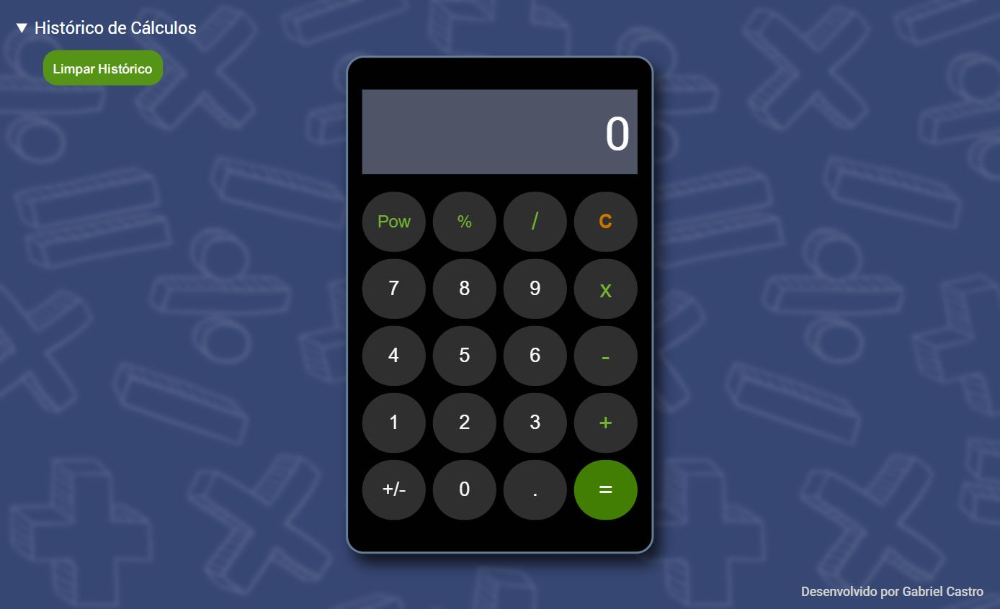

# React Calculator

Projeto desenvolvido como exercício do bootcamp Orange Tech+ da Dio, com intuíto de prática em ReactJS. O exercício proposto era melhorar a página e implementar novas funcionalidades em uma calculadora.

# Implementações
- Estilização da página utilizando Styled Components
- Adição de números decimais
- Adição de novas operações (Potência, Porcentagem, Inversão de Sinal)
- Histórico de cálculos
- Tratamento de números decimais
- Responsividade

# Tecnologias utilizadas:
- HTML
- CSS
- JavaScript
- ReactJS
- Styled Components
- Git/GitHub

[Clique aqui para acessar o projeto](https://axlbr.github.io/react-calculator/)

# Contato
gabrieltoby@gmail.com
